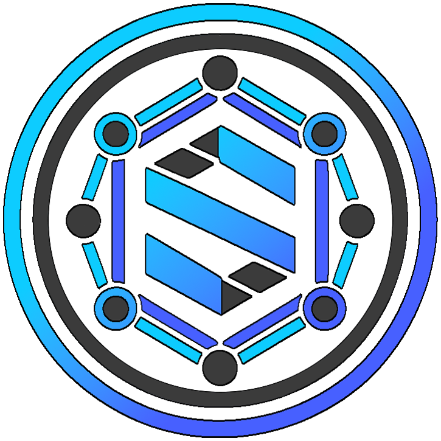

# Synergy Network Documentation

<p align="center">
  
</p>

<p align="center">
  <b>A next-generation blockchain platform featuring Proof of Synergy consensus and Post-Quantum Cryptography</b>
</p>

## Documentation Index

- [Project Overview](../README.md) - Main project overview and quick start guide
- [Setup Guide](../SETUP.md) - Detailed installation and configuration instructions
- [Architecture](./ARCHITECTURE.md) - Technical architecture and system design
- [Token Economics](../tokenomics/token_economics.md) - Token distribution and economic model

## About Synergy Network

Synergy Network is a revolutionary blockchain platform that introduces the novel Proof of Synergy consensus mechanism, which prioritizes collaboration over competition. The network features Post-Quantum Cryptography to ensure long-term security against quantum computing threats.

With a total supply of 10 billion SYN tokens, Synergy Network aims to create a sustainable ecosystem for decentralized applications, while providing robust security, scalability, and user-friendly interfaces.

## Key Features

- **Proof of Synergy Consensus**: A collaborative consensus mechanism with validator clusters
- **Post-Quantum Cryptography**: Future-proof security using Dilithium and Kyber algorithms
- **Synergy Points System**: Reputation-based validator scoring mechanism
- **Validator Clusters**: Dynamic grouping of validators for efficient task processing
- **Synergy Naming System (SNS)**: Human-readable addresses and domain names
- **ICO Pre-sale Platform**: Integrated token sale functionality
- **Comprehensive Explorer**: Full visibility into blockchain operations

## Project Structure

The Synergy Network project is organized into the following components:

- **tokenomics/**: Token economics configuration with 10 billion SYN supply
- **web_portal/**: React-based web portal with ICO pre-sale functionality
- **backend/**: Express.js backend services for the web portal
- **testnet/**: Testnet environment with Proof of Synergy consensus
- **docs/**: Comprehensive documentation

## Getting Started

Please refer to the [Setup Guide](../SETUP.md) for detailed instructions on how to install and run the Synergy Network components.

For a quick start, you can use the following commands:

```bash
# Install all dependencies
npm run install-all

# Start the testnet node
npm run start-testnet

# Start the web portal and backend
npm run start-all
```

## Contributing

Contributions to the Synergy Network project are welcome. Please ensure you follow the coding standards and submit comprehensive pull requests.

## License

This project is licensed under the MIT License - see the LICENSE file for details.

## Contact

For more information, please contact the Synergy Network team at info@synergy-network.io
